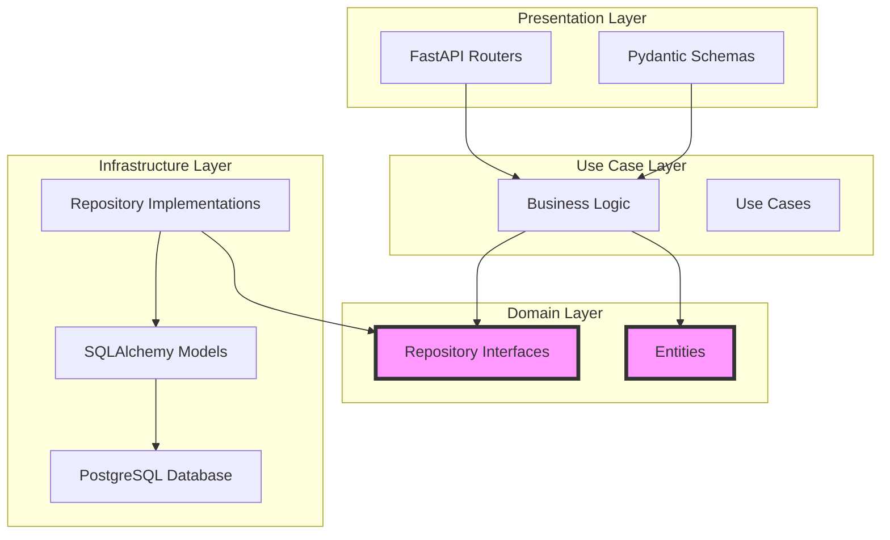

# FastAPI Clean Architecture | Production-Ready Python DDD Template

[](https://www.python.org/downloads/)
[](https://fastapi.tiangolo.com)
[](https://www.postgresql.org/)
[](LICENSE)
[](https://docs.astral.sh/ruff/)
[](docs/ARCHITECTURE.md)
[](docs/ARCHITECTURE.md)

> **Production-ready FastAPI template implementing strict Clean Architecture principles with Domain-Driven Design, perfect for building scalable, maintainable Python web applications in 2026.**

A comprehensive FastAPI Clean Architecture reference implementation that demonstrates how to build production-ready Python web applications using strict layer separation, dependency inversion, and hexagonal architecture patterns. This template serves as a go-to example for developers seeking to implement Clean Architecture with FastAPI, PostgreSQL, and modern async Python practices.

## Why FastAPI Clean Architecture?

This project addresses the most common challenges developers face when building production FastAPI applications:

- **Maintainability**: Clear separation of concerns makes code easier to understand and modify
- **Testability**: Dependency inversion enables easy mocking and unit testing
- **Scalability**: Modular domain structure supports growing business complexity
- **Team Collaboration**: Consistent architecture patterns across development teams
- **Production-Ready**: Includes error handling, validation, logging, and migrations out of the box

### Key Benefits

**For Senior Developers**
- Proven architecture patterns from real-world production systems
- Comprehensive error handling with structured exception hierarchy
- Async/await throughout for optimal performance
- Dynamic settings reloading for zero-downtime configuration updates

**For Teams**
- Clear conventions reduce cognitive load and onboarding time
- Domain boundaries prevent coupling between business areas
- Consistent patterns make code reviews more efficient
- Easy to scale horizontally with modular domain structure

**For Learning**
- Working example of Clean Architecture in Python
- Step-by-step domain creation guide
- Complete documentation with diagrams
- Real-world patterns you can apply immediately

## Quick Start

Get up and running in under 5 minutes with our streamlined setup process.

### Prerequisites

- **Python 3.12+** - Latest stable Python release
- **uv** - Fast Python package installer ([installation guide](https://github.com/astral-sh/uv?tab=readme-ov-file#installation))
- **Docker & Docker Compose** - For PostgreSQL container
- **make** - Build automation tool (included with most Unix-like systems)

### Installation

```bash
# Clone the repository
git clone https://github.com/JoshuaPangaribuan/fastapi-clean-architecture.git
cd fastapi-clean-architecture

# Install dependencies with uv (faster than pip)
uv sync

# Start PostgreSQL container
docker-compose up -d

# Run migrations and start dev server
make dev
```

That's it! Your FastAPI application is now running at:
- **Swagger UI**: http://localhost:8000/docs
- **ReDoc**: http://localhost:8000/redoc

## Architecture Overview

This project implements **Clean Architecture** principles with strict layer separation and dependency inversion. The dependency flow always points inward: Presentation → Use Cases → Domain, with Infrastructure implementing Domain interfaces.



### Layer Dependency Rules

| Layer | Can Import From | Cannot Import From |
|-------|-----------------|-------------------|
| **Domain** (entities, repositories) | None | All other layers |
| **Use Cases** | Domain only | Infrastructure, Presentation |
| **Infrastructure** (models, repositories) | Domain, Use Cases | Presentation |
| **Presentation** (routers, schemas) | Domain, Use Cases | - (prefer Use Cases) |

## Key Features

### Architecture Patterns

- **Pure Clean Architecture** - Strict layer separation with dependency inversion
- **Domain-Driven Design** - Business logic organized around domain concepts
- **Hexagonal Architecture** - Ports (repository interfaces) and adapters (implementations)
- **Repository Pattern** - Database access abstraction for easy testing
- **Mapper Pattern** - Three-level mapping (Entity ↔ Model ↔ DTO)

### Production-Ready Features

- **Async/Await throughout** - Full async stack with SQLAlchemy 2.0+ and asyncpg
- **PostgreSQL Integration** - Production-grade database with connection pooling
- **Alembic Migrations** - Database schema version control and rollback support
- **Dynamic Settings Reloading** - Zero-downtime configuration updates
- **Structured Error Handling** - Custom exception hierarchy with global handlers
- **Pydantic Validation** - Request/response validation with detailed error messages
- **CORS Middleware** - Configured for cross-origin requests
- **OpenAPI Documentation** - Auto-generated interactive API docs

### Developer Experience

- **Comprehensive Makefile** - One-command development workflow
- **Docker Compose** - Instant PostgreSQL setup
- **uv Package Manager** - Lightning-fast dependency management
- **ruff Formatting** - Fast Python linter and formatter
- **Auto-Reload** - Development server restarts on code changes
- **Type Hints** - Full type annotations for better IDE support

## Project Structure

```
fastapi-clean-architecture/
├── alembic/                          # Database migrations
│   └── versions/                     # Migration scripts
├── docs/                             # Comprehensive documentation
│   ├── ARCHITECTURE.md               # Complete technical guide
│   ├── DOMAIN_CREATION.md            # Step-by-step domain tutorial
│   ├── FAQ.md                        # Frequently asked questions
│   └── MIGRATION_GUIDE.md            # Transition from traditional FastAPI
├── examples/                         # Code examples and templates
│   └── README.md                     # Example use cases
├── src/
│   └── app/
│       ├── core/                     # Cross-cutting concerns
│       │   ├── config/               # Pydantic Settings with dynamic reloading
│       │   ├── database/             # SQLAlchemy engine and session
│       │   ├── errors/               # Custom exception hierarchy
│       │   ├── logging/              # Structured logging setup
│       │   └── validation/           # Shared validation utilities
│       ├── domains/                  # Business domains
│       │   └── user/                 # Example domain (complete implementation)
│       │       ├── entities/         # Domain entities (pure business objects)
│       │       ├── repositories/     # Repository interfaces (ports/ABCs)
│       │       ├── use_cases/        # Business logic orchestration
│       │       ├── infrastructure/   # Database implementations (adapters)
│       │       │   └── database/
│       │       │       ├── models.py          # SQLAlchemy models
│       │       │       └── user_repository_impl.py
│       │       ├── mappers/          # Data transformation layer
│       │       │   ├── base_mapper.py
│       │       │   ├── entity_model_mapper.py
│       │       │   ├── entity_dto_mapper.py
│       │       │   └── entity_schema_mapper.py
│       │       └── presentation/
│       │           └── v1/          # API versioning
│       │               ├── router.py         # FastAPI routers
│       │               └── schemas.py        # Pydantic schemas
│       └── main.py                   # Application entry point
├── .env.example                      # Environment variables template
├── CLAUDE.md                         # Development guide for Claude Code
├── CONTRIBUTING.md                   # Contribution guidelines
├── docker-compose.yml                # PostgreSQL container configuration
├── Makefile                          # Build automation commands
├── alembic.ini                       # Alembic configuration
├── pyproject.toml                    # Python dependencies
└── README.md                         # This file
```

## Development Workflow

### Quick Start (One Command)

```bash
# Run migrations + start server in one command
make dev
```

This command:
1. ✅ Runs all pending database migrations
2. ✅ Starts FastAPI server with auto-reload
3. 📖 Opens interactive API docs at http://localhost:8000/docs

### Step-by-Step Development

```bash
# 1. Start PostgreSQL (first time only)
make db-up

# 2. Run migrations (after model changes)
make migrate-up

# 3. Start server
make run
```

### Database Migrations

```bash
# Create new migration (after modifying models)
make migrate-new MSG="add phone column to users"

# Apply all pending migrations
make migrate-up

# Rollback last migration
make migrate-down

# Downgrade then upgrade (useful for testing)
make migrate-refresh

# Reset database (delete all data and recreate)
make db-reset
```

### Code Quality

```bash
# Format code with ruff
make fmt

# Lint code with ruff
make lint
```

## Available Commands

| Command | Description |
|---------|-------------|
| `make dev` | Run migrations + start dev server (recommended) |
| `make run` | Start server only (without migrations) |
| `make migrate-up` | Apply database migrations |
| `make migrate-down` | Rollback last migration |
| `make migrate-new MSG='desc'` | Create new migration |
| `make migrate-refresh` | Downgrade then upgrade (testing) |
| `make db-reset` | Reset PostgreSQL + fresh migrations |
| `make db-up` | Start PostgreSQL container |
| `make db-down` | Stop PostgreSQL container |
| `make db-logs` | View PostgreSQL logs |
| `make fmt` | Format code (ruff) |
| `make lint` | Lint code (ruff) |

Run `make help` for a complete list of available commands.

## Tech Stack

### Core Framework
- **FastAPI 0.128+** - Modern, fast web framework for building APIs
- **Python 3.12+** - Latest stable Python with improved type hints and performance

### Database & ORM
- **PostgreSQL 16** - Production-grade relational database
- **SQLAlchemy 2.0+** - Python SQL toolkit and ORM with async support
- **asyncpg** - High-performance PostgreSQL driver for asyncio
- **Alembic** - Database migration tool with auto-generation support

### Data Validation & Settings
- **Pydantic** - Data validation using Python type annotations
- **Dynamic Settings** - Zero-downtime configuration reloading

### Development Tools
- **uv** - Fast Python package installer (10-100x faster than pip)
- **make** - Build automation and task runner
- **Docker & Docker Compose** - Containerization for PostgreSQL
- **ruff** - Fast Python linter and formatter

### Architecture Patterns
- **Clean Architecture** - Layered architecture for maintainable code
- **Domain-Driven Design** - Business logic organized around domains
- **Repository Pattern** - Database access abstraction
- **Dependency Injection** - Loose coupling through dependency inversion

## Creating New Domains

This template makes it easy to add new business domains following Clean Architecture principles. Each domain is self-contained with its own entities, use cases, infrastructure, and presentation layers.

**Quick Example**:

```python
# 1. Create domain entity
# src/app/domains/product/entities/product.py
@dataclass
class ProductEntity:
    name: str
    price: Decimal
    # Business rules enforced here

# 2. Create repository interface
# src/app/domains/product/repositories/product_repository.py
class ProductRepositoryInterface(ABC):
    @abstractmethod
    async def create(self, product: ProductEntity) -> ProductEntity:
        pass

# 3. Create use case
# src/app/domains/product/use_cases/create_product.py
class CreateProductUseCase:
    async def execute(self, input_data: CreateProductInput) -> CreateProductOutput:
        # Business logic orchestration
        pass

# 4. Create infrastructure implementation
# src/app/domains/product/infrastructure/database/product_repository_impl.py
class ProductRepositoryImpl(ProductRepositoryInterface):
    async def create(self, product: ProductEntity) -> ProductEntity:
        # SQLAlchemy implementation
        pass
```

For a complete step-by-step guide, see [docs/DOMAIN_CREATION.md](docs/DOMAIN_CREATION.md).

## API Documentation

Once the server is running, interactive API documentation is available:

- **Swagger UI**: http://localhost:8000/docs - Interactive API exploration
- **ReDoc**: http://localhost:8000/redoc - Alternative documentation format
- **OpenAPI Schema**: http://localhost:8000/openapi.json - Machine-readable schema

The API includes automatic:
- Request validation with Pydantic
- Response serialization
- Error handling with structured responses
- Authentication placeholders
- Rate limiting placeholders

## Error Handling

This template includes a comprehensive error handling system:

```python
# Custom exception hierarchy
class ResourceNotFoundError(AppError):
    """Raised when a resource is not found."""

class ResourceConflictError(AppError):
    """Raised when a resource already exists."""

class DomainError(AppError):
    """Raised when business rules are violated."""

# Structured error responses
{
    "code": "USER_NOT_FOUND",
    "message": "User with id 123 not found",
    "details": {"user_id": "123"},
    "timestamp": "2026-01-09T12:00:00Z",
    "request_id": "abc-123"
}
```

Global exception handlers automatically map exceptions to appropriate HTTP status codes (404, 409, 422, 500, etc.).

## Testing

While this template focuses on architecture, it's designed to be highly testable:

```python
# Easy to mock dependencies
async def test_create_user():
    # Arrange
    mock_repo = Mock(spec=UserRepositoryInterface)
    mock_mapper = Mock(spec=UserEntityDtoMapper)
    use_case = CreateUserUseCase(mock_repo, mock_mapper)

    # Act
    result = await use_case.execute(CreateUserInput(email="test@example.com", name="Test"))

    # Assert
    assert result.email == "test@example.com"
```

Add testing capabilities:

```bash
# Install test dependencies
uv pip add pytest pytest-asyncio httpx

# Run tests (add to Makefile)
make test
```

## Security Best Practices

- **Environment Variables**: Sensitive configuration in `.env` files (never committed)
- **CORS Configuration**: Configure allowed origins in production
- **SQL Injection Prevention**: SQLAlchemy ORM with parameterized queries
- **Input Validation**: Pydantic schemas validate all inputs
- **Error Messages**: Sanitized error responses (no sensitive data in production)
- **DEBUG Mode**: Always set `DEBUG=False` in production

## Performance Considerations

- **Async/Await throughout**: Full async stack for optimal performance
- **Connection Pooling**: SQLAlchemy manages database connections efficiently
- **Lazy Loading**: Selective data loading to avoid N+1 queries
- **Indexing**: Add database indexes for frequently queried fields
- **Caching**: Consider Redis for caching (not included in template)

## Documentation

- **[Architecture Guide](docs/ARCHITECTURE.md)** - Complete technical deep-dive
- **[Domain Creation Tutorial](docs/DOMAIN_CREATION.md)** - Step-by-step guide
- **[FAQ](docs/FAQ.md)** - Common questions and answers
- **[Migration Guide](docs/MIGRATION_GUIDE.md)** - Transition from traditional FastAPI
- **[Examples](examples/README.md)** - Code samples and templates

## Contributing

We welcome contributions! Please see [CONTRIBUTING.md](CONTRIBUTING.md) for guidelines.

## Comparison with Traditional FastAPI

| Traditional FastAPI | Clean Architecture FastAPI |
|---------------------|----------------------------|
| Business logic in routers | Business logic in use cases |
| Direct database access | Repository abstraction |
| Tight coupling | Loose coupling via interfaces |
| Hard to test | Easy to test (mock dependencies) |
| Monolithic structure | Modular domain structure |
| Mixed concerns | Clear separation of concerns |

Learn more in our [Migration Guide](docs/MIGRATION_GUIDE.md).

## Use Cases

This template is ideal for:

- **SaaS Applications** - Multi-tenant applications with clear domain boundaries
- **REST APIs** - Building scalable backend services
- **Microservices** - Independent, deployable services
- **Enterprise Applications** - Large-scale applications requiring maintainability
- **Learning Projects** - Understanding Clean Architecture in Python
- **Production Templates** - Starting real-world projects with best practices

## Resources

- **[FastAPI Documentation](https://fastapi.tiangolo.com/)** - Official FastAPI docs
- **[Clean Architecture by Robert C. Martin](https://blog.cleancoder.com/uncle-bob/2012/08/13/the-clean-architecture.html)** - Original article
- **[Domain-Driven Design by Eric Evans](https://www.domainlanguage.com/ddd/)** - DDD fundamentals
- **[SQLAlchemy 2.0 Documentation](https://docs.sqlalchemy.org/en/20/)** - ORM guide
- **[Alembic Documentation](https://alembic.sqlalchemy.org/)** - Migration tool

## License

This project is licensed under the MIT License - see the [LICENSE](LICENSE) file for details.

## Stargazers

[](https://starchart.cc/JoshuaPangaribuan/fastapi-clean-architecture)

---

**Built with ❤️ using FastAPI Clean Architecture**

*Keywords: FastAPI clean architecture, Clean architecture Python, Domain-driven design FastAPI, FastAPI project structure, Production-ready FastAPI template, Hexagonal architecture FastAPI, FastAPI best practices 2026, Python async architecture, SQLAlchemy repository pattern, FastAPI dependency injection*
